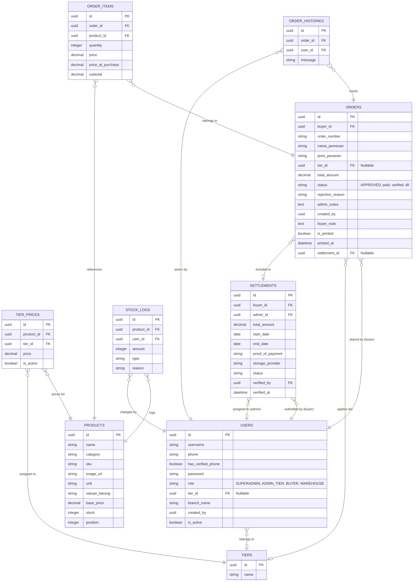
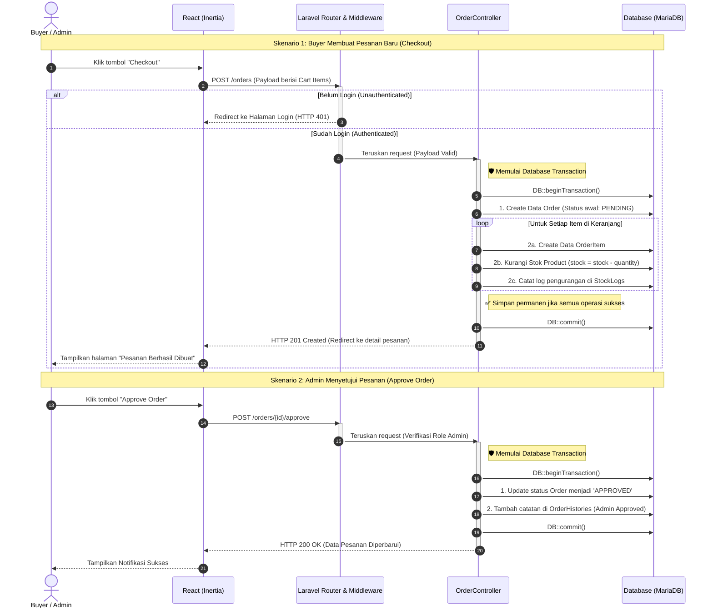
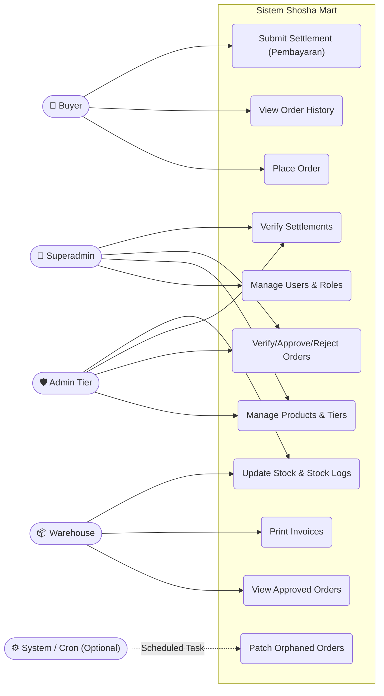

# Shosha Mart - Technical Documentation

Dokumentasi ini berisi analisis mendalam mengenai arsitektur sistem, skema database, alur logika utama, serta rekomendasi optimasi untuk project Shosha Mart (Laravel 11, Inertia.js v3, React, MariaDB).

## 1. Entity Relationship Diagram (ERD)

Diagram berikut menjelaskan relasi antar entitas utama di dalam database. Sistem ini menggunakan **UUID** sebagai Primary Key (PK) untuk sebagian besar tabel guna meningkatkan keamanan dan memfasilitasi integrasi sistem terdistribusi.



### Penjelasan Relasi Antar Tabel (Panduan Developer)

Bagian ini menguraikan makna dari garis-garis relasi pada diagram database di atas:

1. **`USERS` & `TIERS` (Many-to-One / Nullable)**
   * **Logika Bisnis:** Satu level tingkatan pelanggan (misal: "Reseller", "Distributor") yang ada di `TIERS` bisa menaungi banyak `USERS`. Kolom `tier_id` pada Users bersifat *nullable* karena mungkin tidak semua user memiliki tingkatan khusus.
2. **`ORDERS` & `USERS` (Many-to-One)**
   * **Logika Bisnis:** Seorang pembeli (`User`) dapat membuat banyak pesanan (`Order`). Setiap record `Order` pasti diikat ke tepat satu `User` sebagai pembelinya (`buyer_id`).
3. **`ORDERS` & `ORDER_ITEMS` (One-to-Many / Header-Detail)**
   * **Logika Bisnis:** Satu lembar nota pesanan (`Order`) menampung banyak baris barang (`OrderItem`). Ini adalah relasi keranjang belanja standar.
4. **`ORDER_ITEMS` & `PRODUCTS` (Many-to-One)**
   * **Logika Bisnis:** Setiap baris barang (`OrderItem`) pasti merujuk kembali ke master data barang (`Product`). **Catatan Penting:** `OrderItem` merekam harga _snapshot_ (`price_at_purchase`) agar total tagihan nota lama tidak ikut berubah jika harga master produk naik di masa depan.
5. **`PRODUCTS`, `TIERS` & `TIER_PRICES` (Many-to-Many Pivot)**
   * **Logika Bisnis:** Karena 1 produk harganya bisa berbeda-beda untuk tiap tingkatan user (Tier), maka dibuatlah tabel perantara `TIER_PRICES`. Tabel ini mencatat: "Produk A untuk Tier B harganya sekian".
6. **`ORDERS` & `ORDER_HISTORIES` (One-to-Many / Audit Trail)**
   * **Logika Bisnis:** Setiap `Order` memiliki log riwayat perubahan (`ORDER_HISTORIES`). Fungsinya merekam siapa user/admin yang mengubah status pesanan (misal: dari PENDING menjadi APPROVED) dan kapan itu terjadi.
7. **`PRODUCTS`, `USERS` & `STOCK_LOGS` (Audit Inventory)**
   * **Logika Bisnis:** `STOCK_LOGS` adalah buku mutasi gudang. Setiap stok `Product` bertambah/berkurang, sistem mewajibkan pencatatan: siapa (`User`) pelakunya, seberapa banyak angkanya, dan untuk alasan apa (misal: "Barang Terjual" atau "Koreksi Manual").
8. **`SETTLEMENTS` & `ORDERS` (One-to-Many / Tagihan Gabungan)**
   * **Logika Bisnis:** Pembeli kadang berbelanja beberapa kali (kasbon) sebelum membayar lunas. `SETTLEMENTS` menggabungkan banyak nota `Order` yang belum lunas menjadi satu bukti transfer/pembayaran tagihan.

### Analisis Constraints & Tipe Data:
- **Primary Key (PK):** Konsisten menggunakan `UUID` ketimbang _Auto-Increment integer_. Hal ini membuat ID sulit ditebak (_security via obscurity_) dan mencegah bentrok ID jika mengimpor data antar server.
- **Uang / Finansial:** Kolom `price`, `subtotal`, dan `total_amount` direpresentasikan sebagai tipe `DECIMAL`, bukan `FLOAT`. Ini adalah aturan emas (Best Practice) akuntansi agar perhitungan desimal tidak meleset (menghindari error _floating-point_).

---

## 2. Sequence Diagram (Core Transaction Flow)

Alur berikut menggambarkan siklus transaksi inti (Order Creation & Approval Flow) dari sisi Client hingga ke eksekusi Database.



---

## 3. Use Case Diagram

Identifikasi _Actor_ (berdasarkan Role pada `User`) dan _Boundaries_ fungsional sistem.



---

## 4. Project Analysis & Best Practices

Berdasarkan _tech-stack_ dan pola arsitektur kode, berikut adalah analisis dan rekomendasi profesional:

### a. Folder Structure Overview
Sistem mengadopsi standar MVC arsitektur Monolith modern dengan Inertia.js:
- **`app/Models/` & `app/Http/Controllers/`**: Menangani _business logic_ dan interaksi Eloquent ORM.
- **`routes/web.php`**: Berperan ganda untuk me-_render_ UI dan menerima API endpoint internal dari Inertia React.
- **`database/migrations/`**: Menggunakan _incremental schema updates_, memudahkan *version control*.
- **`resources/js/`**: Mengelola *frontend components* (React) dan state manajemen _client-side_ (sejalan dengan dokumentasi Inertia v3).

### b. Potensi Bottleneck (Kelemahan Performa)
1. **N+1 Query Problem**: Pemanggilan relasi kompleks (seperti `Order::all()` yang memanggil `items`, `products`, `buyer`, `tier`) di halaman `orders.index` akan menyebabkan lonjakan _query_ SQL secara eksponensial.
2. **Race Condition pada Pengurangan Stok**: Jika dua _buyer_ secara bersamaan _checkout_ produk dengan sisa stok 1, berpotensi menghasilkan stok negatif.
3. **Pemuatan Aset Gambar**: Field `image_url` pada `Product` dan `proof_of_payment` pada `Settlement` perlu diwaspadai jika resolusi gambar tidak dikompresi di sisi server/client.

### c. Saran Optimasi & Keamanan (Best Practices)
1. **Pessimistic Locking Database**: Saat mengurangi stok di `OrderController@store`, gunakan implementasi _Row-Level Locking_:
   ```php
   $product = Product::where('id', $itemId)->lockForUpdate()->first();
   if ($product->stock < $quantity) { throw new Exception("Out of stock"); }
   ```
2. **Eager Loading Optimization**: Terapkan metode `.with()` secara ketat pada _controller_ saat memuat data relasi.
   ```php
   // Hindari: Order::get();
   // Gunakan:
   $orders = Order::with(['buyer:id,username', 'items.product:id,name', 'tier'])->paginate(15);
   ```
3. **Database Transaction Resilience**: Selalu bungkus logic yang menyentuh lebih dari satu tabel (contoh: Order + OrderItem + StockLog) dalam `DB::transaction()`. Jika ada proses yang gagal, data akan otomatis di-_rollback_ tanpa merusak integritas database.
4. **Validasi Form Request Eksternal**: Pisahkan logic validasi ke class khusus (`app/Http/Requests/*`) daripada diletakkan langsung di dalam `Controller`. Ini membuat _controller_ menjadi lebih ramping (Solid Principles) dan reusable.
5. **Caching Harga / Tier**: Data seperti `TierPrice` jarang berubah. Lakukan _caching_ menggunakan Redis (misalnya `Cache::remember('tier_prices_product_'.$id)`) untuk menekan beban database per _request_.
